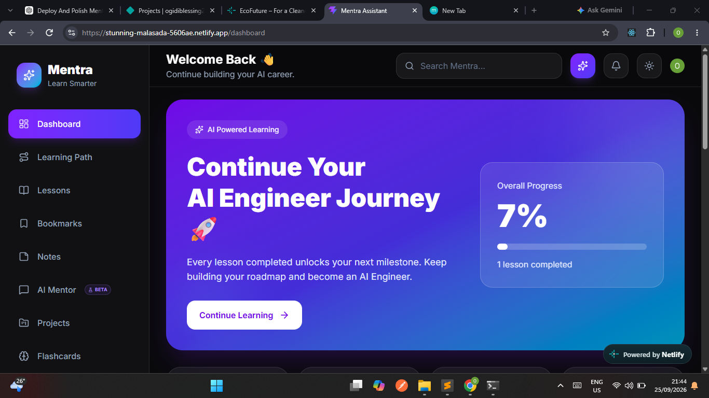

# Mentra

> An AI-powered learning platform that turns a learner's career goal into a personalized roadmap, lessons, quizzes, projects, and an AI mentor.



## 🚀 Live Demo

**[Try Mentra →](https://dulcet-faloodeh-96d21b.netlify.app/)**

**[View Source Code →](YOUR_GITHUB_URL)**

---

## 🧠 What is Mentra?

Learning to code can be confusing.

There are thousands of tutorials, courses, documentation pages, and videos, but it can be difficult to know:

- What should I learn first?
- What should I learn next?
- Am I actually improving?
- What should I build?
- Where can I get help when I'm stuck?

I built **Mentra** to make that process more structured.

A learner starts by providing their career goal, experience level, and learning goal. Mentra then generates a personalized roadmap with modules and lessons that guide them through their learning journey.

The learner can study lessons, take AI-generated quizzes, earn XP, track progress, ask an AI Mentor for help, and manage projects.

---

# ✨ Features

### 🧭 Personalized AI Roadmaps

New users provide:

- Career goal
- Experience level
- Learning goal

Mentra uses AI to generate a personalized learning roadmap.

### 📚 Lessons & Progress

Generated roadmaps are divided into modules and lessons so learners can follow a structured learning path and track their progress.

### 🤖 AI Mentor

The AI Mentor helps learners:

- Understand difficult concepts
- Get coding help
- Ask questions
- Create study plans
- Learn through AI-powered explanations
- Explore visual learning assistance

### 🧠 AI-Generated Quizzes

Mentra can generate quizzes based on learning content.

Completing quizzes contributes to the learner's XP and learning progress.

### 🏆 XP & Achievements

Learners can earn XP as they use Mentra and complete learning activities.

Achievements provide additional milestones to work toward.

### 📁 Project Management

Learners can create projects, add tasks, track task progress, and connect projects with GitHub repositories or live demos.

### 🔐 Secure Authentication

Mentra uses Clerk to securely authenticate users and protect application data.

---

# 🛠️ Tech Stack

## Frontend

- React
- Vite
- React Router
- Tailwind CSS
- TanStack Query
- Clerk React
- Sonner
- Lucide React

## Backend

- Node.js
- Express
- ES Modules
- Clerk
- Gemini AI
- Drizzle ORM

## Database

- PostgreSQL
- Neon
- Drizzle ORM

## Deployment

- Netlify — Frontend
- Render — Backend
- Neon — Database

---

# 🔄 How Mentra Works

```text
                    NEW USER
                       │
                       ▼
                  Sign Up
                       │
                       ▼
                  Onboarding
                       │
          ┌────────────┼────────────┐
          ▼            ▼            ▼
       Career        Level         Goal
          │            │            │
          └────────────┼────────────┘
                       ▼
                AI Roadmap
                       │
                       ▼
                 Modules
                       │
                       ▼
                   Lessons
                       │
             ┌─────────┴─────────┐
             ▼                   ▼
           Quiz              AI Mentor
             │                   │
             ▼                   ▼
            XP              Learning Help
             │
             ▼
        Achievements
             │
             ▼
          Project
          6s